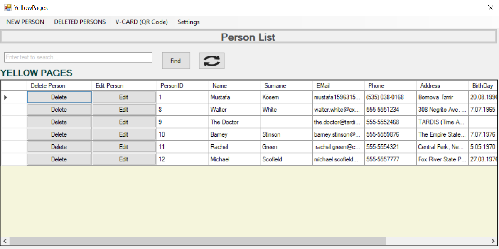
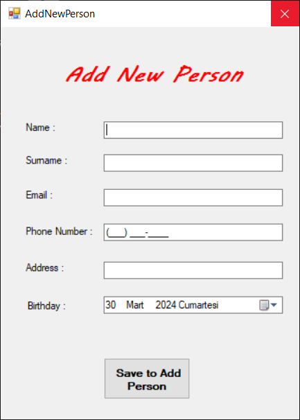
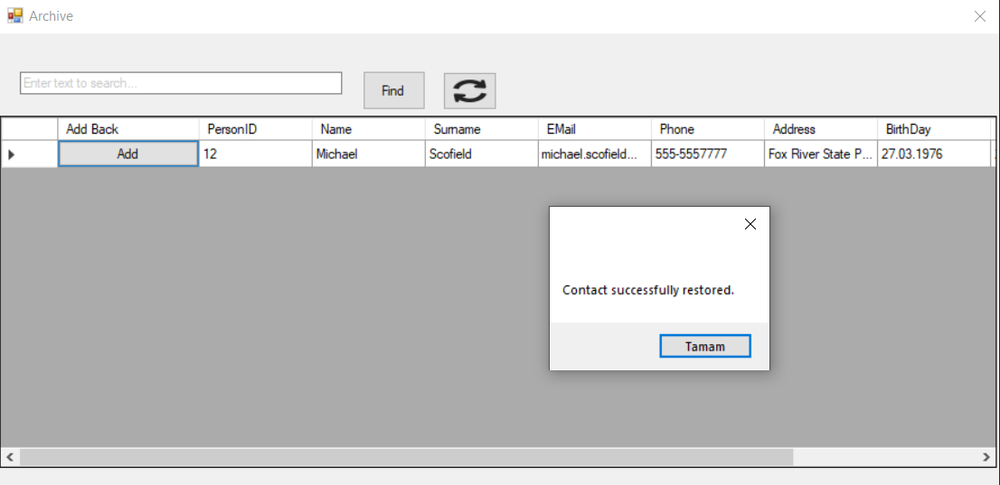

# Telefon Defteri Uygulaması

Bu uygulama, kullanıcıların iletişim bilgilerini organize etmelerine ve yönetmelerine yardımcı olan kullanıcı dostu bir telefon defteri uygulamasıdır.

## Özellikler

Giriş Yapma: Kullanıcılar uygulamaya giriş yaparak kendi telefon defterlerine erişebilirler. Her kullanıcı sadece kendi telefon defterine erişebilir.

Hızlı Arama: Telefon defterindeki kişileri hızlıca bulmak için arama butonlarını kullanabilirsiniz. İsim, telefon numarası veya diğer özelliklerle arama yapabilirsiniz.

Kişi Ekleme, Düzenleme ve Silme: Yeni kişiler ekleyebilir, mevcut kişileri düzenleyebilir ve silebilirsiniz. Ayrıca, yanlışlıkla silinen kişileri arşivden bulup tekrar geri getirebilirsiniz.

QR Kod Oluşturma: Kişilere ait QR kodları oluşturabilirsiniz. Bu QR kodları, kişilere ait iletişim bilgilerini kolayca paylaşmanızı sağlar.

Kullanıcı Bilgilerini Düzenleme: Kullanıcılar, e-posta adreslerini, şifrelerini ve diğer kullanıcı giriş bilgilerini düzenleyebilirler.

Yeni Kullanıcı Ekleme: Yönetici yetkisiyle giriş yapan kullanıcılar, yeni kullanıcılar ekleyebilirler.

## Nasıl Kullanılır

- Uygulamaya giriş yapın.
- Telefon defterinizi görüntüleyin, kişileri arayın, ekleyin, düzenleyin veya silin.
- QR kodlarını oluşturun ve paylaşın.
- Kullanıcı bilgilerinizi düzenleyin veya yeni kullanıcılar ekleyin.

## Kurulum

- Proje dosyalarını bilgisayarınıza indirin veya klonlayın.
- Visual Studio veya benzeri bir geliştirme ortamında projeyi açın.
- Bak dosyası içerisindedir.
- Projeyi derleyin ve çalıştırın.
- Uygulamayı kullanmaya başlayın.

## Kullanılan Teknolojiler

- C# (.NET Framework)
- SQL Server (Veritabanı)

## Katkıda Bulunma

Bu proje açık kaynaklıdır ve katkıda bulunmaktan mutluluk duyarız. Lütfen GitHub deposuna katkıda bulunarak projeyi geliştirmemize yardımcı olun.
